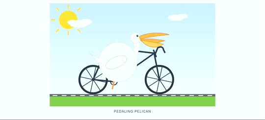
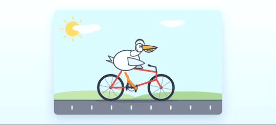

# pi-ds-anchored-standard

[简体中文](README.zh-CN.md)

This Pi extension is a targeted workaround for **DeepSeek V4 Pro 0813**. Its
purpose is to improve that model's performance by giving it a deliberately small
environment for the first request, then returning Pi to normal for the rest of
the session.

The method is inspired by
[`xiaobright/dsh-anchored-standard`](https://github.com/xiaobright/dsh-anchored-standard)
and implemented here through Pi's extension API.

> **Model scope:** the workaround runs only when the active model is DeepSeek V4
> Pro. Every other model keeps ordinary Pi behavior from the first request.

## What changes

### First request only

When a blank session uses DeepSeek V4 Pro and sends its first request to the
model API, the model sees:

| Part of the request | Value |
|---|---|
| System prompt | `You are a helpful software engineer assistant.` |
| Available tools | `bash` and `read` |
| Maximum output | 1,024 tokens |
| Conversation | The system prompt and current user message only |

“Available tools” means the function definitions shown to the model—the actions
it knows it can call. Pi normally shows every enabled built-in tool and every
tool registered by installed extensions. This extension shows only `bash` and
`read` on the first request.

Pi's generated instructions, workspace context, AGENTS.md/CLAUDE.md content,
skill catalog, and prompt additions from other extensions are also left out of
that request.

The extension activates when the active model ID or display name contains
`deepseek-v4-pro` (case-insensitive). If it does not, the extension leaves the
prompt, context, tools, and output limit unchanged.

### After the first tool call or reply

As soon as the model calls a tool or completes its first reply, the extension
returns the session to ordinary Pi behavior:

- every currently enabled Pi tool is available;
- Pi's normal system prompt and workspace context return;
- prompt additions from other extensions return;
- the model's usual maximum output limit returns.

The extension calls this transition **promotion**. By default, either a tool call
or a completed assistant reply triggers it.

If the first response consumes all 1,024 tokens, Pi would normally stop with
`stopReason: "length"`. The extension instead promotes the session and sends one
hidden instruction to continue inside the same agent run. The model keeps its
interrupted work while gaining the normal Pi prompt, tools, and output limit.

## How it is implemented

The core implementation is [`src/phases.ts`](src/phases.ts):

1. Each event checks whether the active model ID or name contains
   `deepseek-v4-pro`. Non-target models keep their enabled tools and unchanged
   request.
2. `session_start` and `before_agent_start` inspect the saved conversation. A
   DeepSeek V4 Pro session with any assistant reply or tool result is already
   promoted.
3. Before the first model call, `before_agent_start` saves Pi's normal system
   prompt and temporarily selects only `bash` and `read`.
4. `before_provider_request` rewrites the final request sent to the model API so
   its prompt, messages, tool definitions, and 1,024-token limit are exact.
5. `tool_call` and `message_end` detect the first promotion event and restore the
   exact tool list that was active before the bootstrap request.
6. If the first response was cut off by the token limit, `message_end` queues one
   same-run continuation using Pi's `deliverAs: "steer"` mode.

There is no separate phase file or database entry. The saved conversation is the
source of truth, so resumed, forked, and reloaded sessions keep the correct
behavior. If `bash` or `read` is unavailable, the extension leaves Pi's active
tool list unchanged instead of applying an incomplete first-request setup.

## Install

```sh
pi install /path/to/pi-ds-anchored-standard
```

Restart Pi or run `/reload`. For a one-off local run:

```sh
pi -e ./src/index.ts
```

## Configuration

The bundled entry uses these defaults:

```ts
createAnchoredStandard({
  bootstrapTools: ["bash", "read"],
  bootstrapMaxTokens: 1024,
  promoteOn: "either",
  minimalPrompt: ANCHORED_MINIMAL_PROMPT,
});
```

`promoteOn` also accepts:

- `"tool-call"`: restore ordinary Pi behavior only after a tool call;
- `"assistant-message"`: restore it only after the first completed reply.

Set `minimalPrompt: null` only if you want Pi's normal prompt and context to stay
in the first request. Configuration changes bootstrap behavior for DeepSeek V4
Pro only; they never enable the workaround for another model.

## Visual validation

We used the same animated-HTML task for eight runs at `high` and `max` thinking
levels. The comparison uses four setups:

1. **Ordinary Pi (extension disabled):** the model receives Pi's normal prompt,
   workspace context, and every enabled tool from the first request. This is the
   control used to show what Pi does without this extension.
2. **New follow-up turn (first attempt):** the extension limits the first request,
   but a truncated response starts a separate follow-up turn. This was an early
   implementation that lost the model's ongoing reasoning.
3. **Continue the same run (current behavior):** the extension limits the first
   request to 1,024 tokens, then continues the interrupted response inside the
   same agent run with ordinary Pi behavior restored.
4. **30,000-token bootstrap:** the current implementation with only
   `bootstrapMaxTokens` raised from 1,024 to 30,000.

<table>
<thead><tr><th></th><th>High</th><th>Max</th></tr></thead>
<tbody>
<tr>
<th>Ordinary Pi<br>(extension disabled)</th>
<td></td>
<td></td>
</tr>
<tr>
<th>New follow-up turn<br>(first attempt)</th>
<td></td>
<td></td>
</tr>
<tr>
<th>Continue the same run<br>(current behavior)</th>
<td></td>
<td></td>
</tr>
<tr>
<th>30,000-token bootstrap</th>
<td></td>
<td></td>
</tr>
</tbody>
</table>

Raising the bootstrap limit did not improve performance consistently. At `high`,
the 30,000-token result was slower and visually worse. At `max`, it was visually
cleaner but took 850.8 seconds instead of 291.5 seconds. This is one visual
example, not a general benchmark.

The [validation directory](validation/animated-html/) contains all eight generated
HTML files, screenshots, animations, complete sanitized Pi conversations, the
sanitizer, and a SHA-256 manifest.

## Trajectory command

`/trajectory` reports word-frequency and response-shape statistics: `let me`,
`we`, and `let's` counts, visible reply count, reasoning-block count, and median
reasoning length. It is inspired by
[`xiaobright/modeltest`'s DeepSeek V4 trajectory analysis](https://github.com/xiaobright/modeltest/blob/main/docs/v4.1/DEEPSEEK_V4_TRAJECTORY_ANALYSIS_20260814.md).
The command is inactive when the current model is not DeepSeek V4 Pro.

Treat this output as a clue, not proof that the extension worked or failed. The
fingerprint came from structured engineering tasks and did not transfer reliably
to the creative animation task above.

## Verify

```sh
npm install
npm test
npm run typecheck
```

The tests cover model gating, first-request shaping, session detection, tool and
prompt restoration, missing bootstrap tools, truncated-response continuation,
and trajectory statistics.

## Notes

- `pi.setActiveTools()` affects the running Pi process, so the extension checks
  the current session before every user turn and reapplies the right tool list.
- A blocked or failed first tool call still promotes the session.
- The minimal prompt applies only to the first request. Pi's saved normal prompt
  returns after promotion.

## License

MIT
