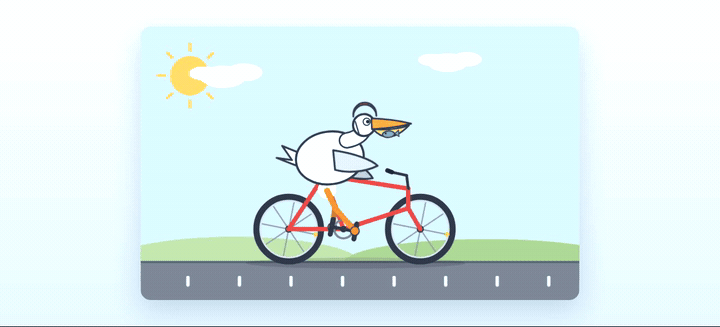

# Animated HTML bootstrap validation

This directory preserves the complete validation campaign for the bootstrap-length continuation fix in `pi-ds-anchored-standard`.

## Prompt

> Generate an HTML containing an animated SVG of a pelican riding a bicycle. Do not test or validate it yourself.

The tested agents did not preview, render, test, or validate their output. Scoring and browser QA were performed externally after each run stopped.

## Configurations

All runs used `deepseek/deepseek-v4-pro` on 2026-08-15 with the same installed Pi extensions except for the control/anchored distinction.

- **Control:** normal Pi prompt and full registered tool catalog from request 1.
- **Anchored:** exact Minimal persona, only `bash` + `read`, `max_tokens: 1024`, and no workspace/skill/extension context on request 1.
- **No continuation:** the capped response ended the run at `stopReason: length`.
- **Follow-up:** the first attempted fix queued a fresh low-level run; it restarted and simplified the work.
- **Steer:** the final fix queues a hidden steering message inside the same agent run and restores the normal prompt, budget, and tools.

## Results

| thinking | configuration | score | file bytes | user→final | thinking chars | browser QA |
|---|---|---:|---:|---:|---:|---|
| high | control | 100/100 | 7,496 | 28.2s | 375 | pass |
| max | control | 100/100 | 6,596 | 142.8s | 28,117 | pass |
| high | anchored, no continuation | 0/100 | 0 | 13.8s | 3,949 | no artifact |
| max | anchored, no continuation | 0/100 | 0 | 19.3s | 4,540 | no artifact |
| high | anchored, fresh follow-up | 100/100 | 4,214 | 35.8s | 5,014 | pass |
| max | anchored, fresh follow-up | 100/100 structural | 7,047 | 45.8s | 5,225 | **fail: SVG root 0×0** |
| high | anchored, same-run steer | 100/100 | 7,662 | 162.5s | 36,478 | pass |
| max | anchored, same-run steer | 100/100 | 14,498 | 291.5s | 57,966 | pass |

The structural checker alone did not catch the follow-up/max rendering defect. Browser QA exposed the zero-sized SVG. Both final steering outputs rendered as recognizable animated pelicans riding bicycles without console or page errors.



`demo.gif` is a six-second, 720-pixel, 10-fps browser recording of the checked-in
`artifacts/anchored-steer-max/pelican-bicycle.html`, converted to GIF for direct
README playback.

The final anchored stop sequence at both thinking levels was:

```text
length → toolUse → toolUse → toolUse → stop
```

Thinking characters by assistant response:

- high: `4,250 + 32,133 + 0 + 95 + 0`
- max: `4,203 + 544 + 69 + 53,042 + 108`

This confirms the user's diagnosis: `followUp` began a fresh low-level run and sharply reduced reasoning. `steer` preserved the interrupted run and restored output quality.

Machine-readable metrics are in [`results.json`](results.json). Exact checker output is under [`results/`](results/).

## Preserved conversations

[`conversations/`](conversations/) contains the complete Pi JSONL entry sequence for all eight runs, including:

- user messages;
- full assistant thinking and visible text;
- tool calls and tool results;
- stop reasons and usage data;
- the hidden `anchored-standard-continuation` message;
- extension bookkeeping entries recorded during the run.

Files:

```text
control-high.jsonl
control-max.jsonl
anchored-no-continuation-high.jsonl
anchored-no-continuation-max.jsonl
anchored-followup-high.jsonl
anchored-followup-max.jsonl
anchored-steer-high.jsonl
anchored-steer-max.jsonl
```

### Sanitization

The checked-in conversations are derived from the original Pi session files with [`sanitize-session.mjs`](sanitize-session.mjs). Conversational content is preserved, while machine-sensitive metadata is transformed:

- session, entry, response, tool-call, and observational-memory IDs become deterministic local IDs;
- absolute timestamps become `elapsedMs` relative to the user prompt;
- the workspace path becomes `$WORKSPACE`;
- home-directory paths become `$HOME`.

The source session files are intentionally not committed. Generated HTML and screenshots contain only the requested pelican artwork.

## Artifacts

Each subdirectory under [`artifacts/`](artifacts/) contains the prompt and any generated HTML/screenshot for that run. Runs that stopped before writing contain only `prompt.txt`.

## Re-run structural checks

```sh
for run in validation/animated-html/artifacts/*; do
  python3 validation/animated-html/check.py "$run" || true
done
```

`SHA256SUMS` records the committed validation bundle after sanitization.
